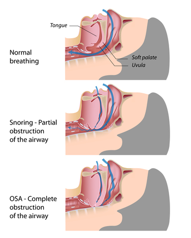
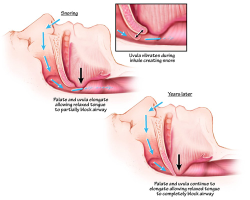
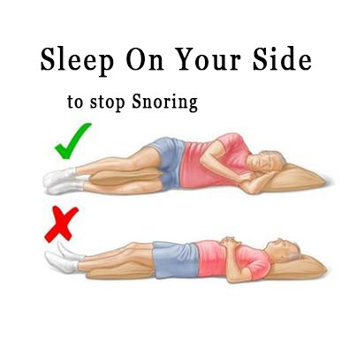
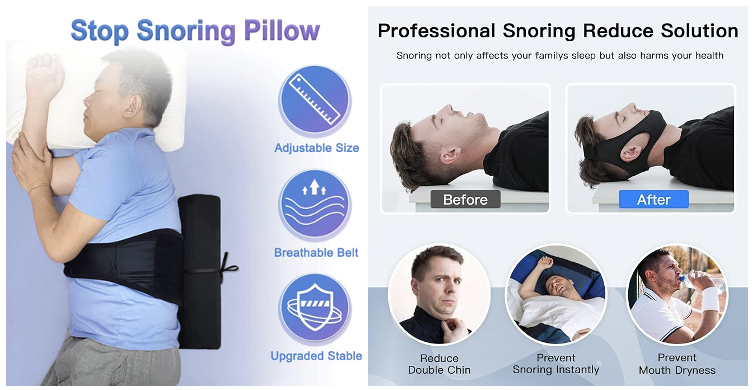
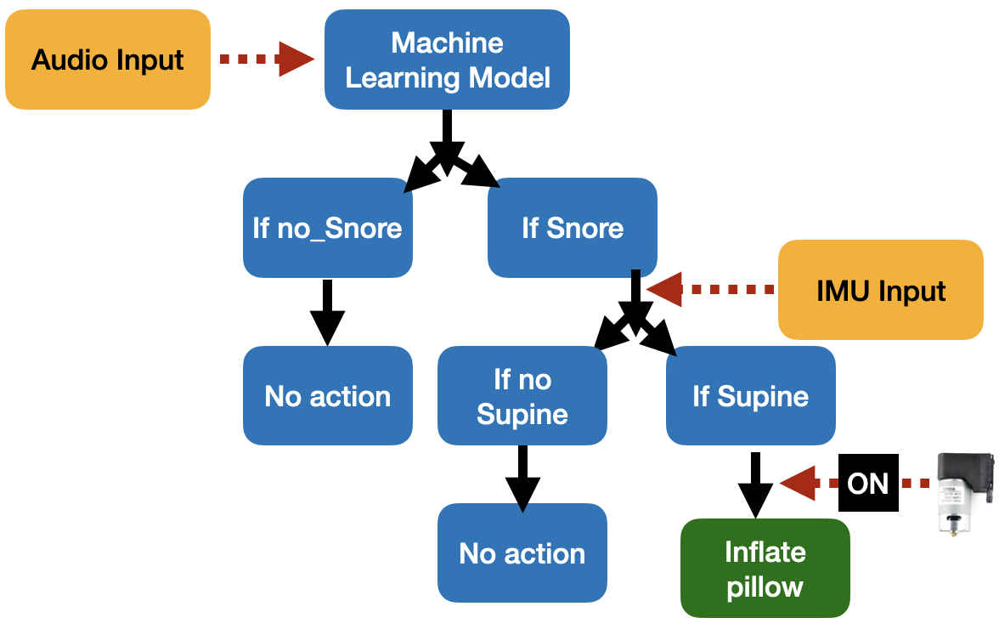
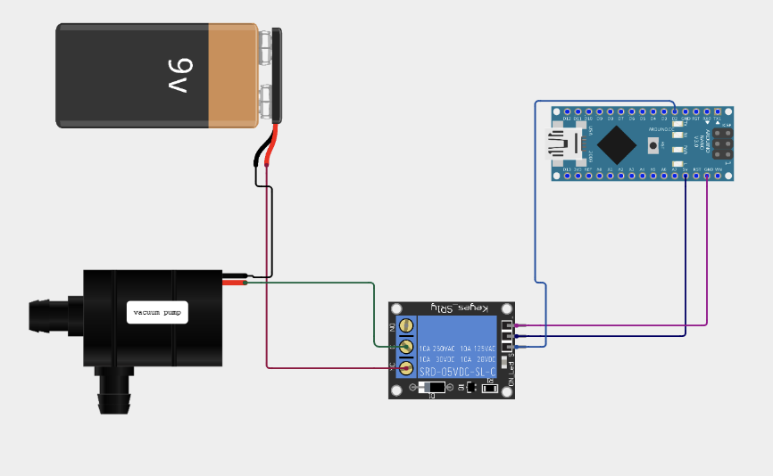
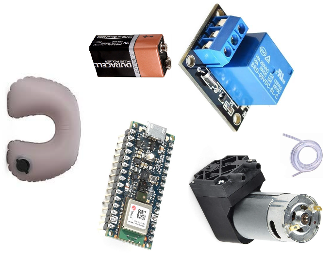
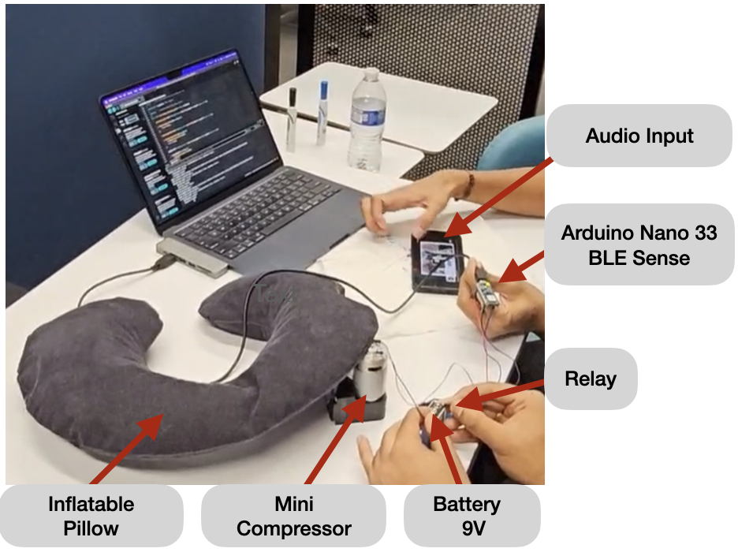
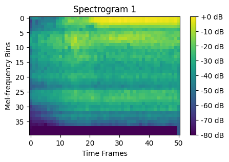

# SnoreGuard-ML-Powered-Pillow-for-Snore-Detection-and-Sleeping-Posture-Correction-using-TinyML
Embedded Machine Learning | Arduino Nano BLE Sense | Relay | Mini Compressor | Edge Impulse

### Problem
Snoring is often associated with a sleep disordercalled Obstructive Sleep Apnea (OSA), and OSA is a common condition which is linked to cardiac problems and can be fatal if it left untreated. Another problem is insufficient sleep for both himself and others aside from him.
In the United States, insufficient sleep and sleep disorders account for $411 billion in the economic losses and represent 2.28% of the country’s gross domestic product (GDP) annually.

 

Snoring occurs when air cannot flow freely through the airway as a person sleeps. When we sleep on the back, due to gravity’s effect on the throat narrows the airway.
There are several causes of snoring. One of the cause of snoring is **sleeping position**.

### Solution
Turn the Snorer from **Supine** to **Side** position.

### Existing Product in the market

### High Level System Design

### Circuit Design

### Components and Setup
 

### Audio Data Preprocessing and basic training & inference working flow 
Downloaded Snoring dataset from Kaggle.**-->>** Converted audio signal from .wav file to 2D tensor(spectrogram) as shown in the below figure.**-->>** Trained the classification model with CNN(Convolutional Neural Network) architecture.**-->>** Converted the trained model into .tflite and then into .h file. .h file contains the model's weight in array.

### Working Demo 
<video width="600" controls>
  <source src="media/working_demo_animated.mp4" type="video/mp4">
  Your browser does not support the video tag.
</video>

